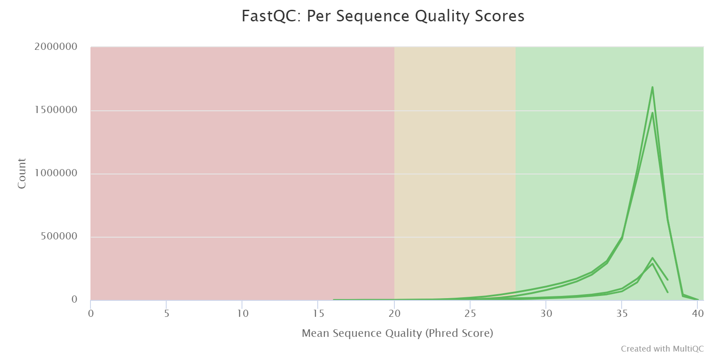

# hse21_hw1

## Выполненные команды
```bash
mkdir homework
cd homework
ls /usr/share/data-minor-bioinf/assembly/ | xargs -P 1 -tI{} ln -s /usr/share/data-minor-bioinf/assembly/{}
seqtk sample -s227 oil_R1.fastq 5000000 > sub_PE_R1.fastq
seqtk sample -s227 oil_R2.fastq 5000000 > sub_PE_R2.fastq
seqtk sample -s227 oilMP_S4_L001_R1_001.fastq 1500000 > sub_MP_R1.fastq
seqtk sample -s227 oilMP_S4_L001_R2_001.fastq 1500000 > sub_MP_R2.fastq
mkdir sub_reports
ls sub* | xargs -P 1 -tI{} fastqc -o sub_reports {}
multiqc sub_reports -o sub_reports
mkdir trim
platanus_trim sub_PE_R1.fastq sub_PE_R2.fastq
platanus_internal_trim sub_MP_R1.fastq sub_MP_R2.fastq
mv -v *trimmed trim
cd trim
ls | xargs -P 1 -tI{} fastqc -o reports {}
multiqc reports -o reports
platanus assemble -o Poil -t 1 -m 16 -f sub_PE_R1.fastq.trimmed sub_PE_R2.fastq.trimmed 2> assemble.log
platanus scaffold -o Poil -t 1 -c Poil_contig.fa -IP2 sub_PE_R1.fastq.trimmed sub_PE_R2.fastq.trimmed -OP2 sub_MP_R1.fastq.int_trimmed sub_MP_R2.fastq.int_trimmed 2> scaffold.log
platanus gap_close -o Poil -t 1 -c Poil_scaffold.fa -IP2 sub_PE_R1.fastq.trimmed sub_PE_R2.fastq.trimmed -OP2 sub_MP_R1.fastq.int_trimmed sub_MP_R2.fastq.int_trimmed 2> gapclose.log

```

## multiQC
[*HTML-файл по неподрезанным чтениям*](/data/multiqc_not_trimmed.html)\
[*HTML-файл по подрезанным чтениям*](/data/multiqc_trimmed.html)

### General Statistics
##### Before Trimming
Sample Name |	% Dups |	% GC |	Length |	M Seqs
-|-|-|-|-
sub_MP_R1 |	4.5% |	44% |	251 bp |	1.5
sub_MP_R2 |	3.9% |	44% |	251 bp |	1.5
sub_PE_R1 |	32.1% |	46% |	101 bp |	5.0
sub_PE_R2	| 30.6%	| 46%	| 101 bp |	5.0

##### Trimmed
Sample Name |	% Dups |	% GC |	Length |	M Seqs
-|-|-|-|-
sub_MP_R1 |	2.4% |	46%  |	111 bp |	0.9
sub_MP_R2 |	2.0% |	45% |	105 bp |	0.9
sub_PE_R1 |	30.3% |	46% |	97 bp |	4.8
sub_PE_R2	| 29.3%	| 46%	| 96 bp |	4.8

### Sequence Quality Histograms
##### Before Trimming

##### Trimmed

### Per Sequence Quality Scores
##### Before Trimming

##### Trimmed

### Adapter Content
##### Before Trimming

##### Trimmed


## [Jupyter Notebook с обработкой полученных данных](/src/Homework_code.ipynb)

## Результат

#### Контиги
Всего контигов: 621\
Размер самого длинного контига: 158992\
Общая длина: 3926082\
N50 = 50103

#### Скаффолды
Всего скаффолдов: 99\
Размер самого длинного скаффолда: 383582\
Общая длина: 3870080\
N50 = 173397\
Число гэпов: 2\
Суммарная длина гэпов: 27

#### Скаффолды после gapClosed
Всего скаффолдов: 99\
Размер самого длинного скаффолда: 383574\
Общая длина: 3870478\
N50 = 173397\
Число гэпов: 0\
Суммарная длина гэпов: 0
